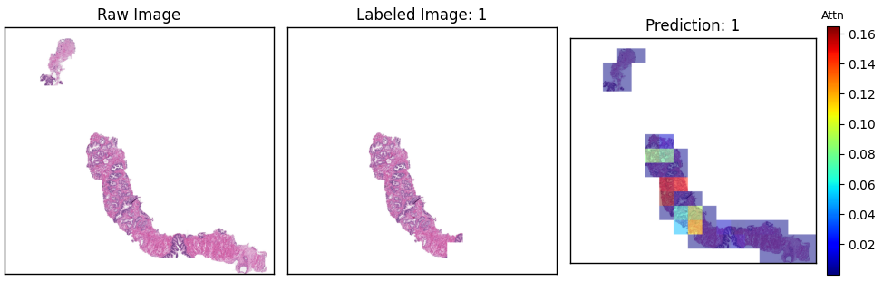

# ABMIL Benchmark for Computational Pathology

This repository benchmarks attention-based multiple-instance learning (MIL) methods for whole-slide image (WSI) classification across three computational-pathology datasets. It supports two input modes:

- **Processed tiles** stored in LMDB, enabling end-to-end training with an image encoder.
- **Pre-extracted tile features**, enabling efficient MIL-only training with a selected encoder's embeddings.

## Repository layout

```text
abmil/
├── datasets/             # Dataset classes and dataloader 
├── engines/              # Training and evaluation engines
├── modules/              # Encoders and MIL model 
├── figures/              # README figures and qualitative 
├── train.py              # Model training entry point
├── validate.py           # Validation entry point
├── inference.py          # Attention-heatmap inference and 
├── options.py            # Command-line arguments and 
├── train_utils.py        # Training utilities and checkpoint 
├── utils.py              # General utility functions
├── requirements.txt      # Python dependencies
```

## Setup

Create and activate a Python environment, then install the dependencies:

```powershell
conda create -n abmil_env python=3.10 -y
conda activate abmil_env
pip install -r requirements.txt
```

## Prepare the processed datasets

Download the processed datasets from [Hugging Face: `kent1122/ComputationalPathology`](https://huggingface.co/datasets/kent1122/ComputationalPathology/tree/main). You may download the files from the web interface, or use the Hugging Face CLI:

```powershell
huggingface-cli download kent1122/ComputationalPathology --repo-type dataset --local-dir .\data
```

Set `--dataset_root_dir` to the directory containing the downloaded dataset folders. The expected structure is:

```text
data/
├── camelyon16/
│   ├── camelyon16.csv
│   ├── camelyon16.lmdb                 # processed tiles (image-input mode)
│   └── {r18,r50,chief,uni,gigap}/      # pre-extracted features
├── panda/
│   ├── panda.csv
│   ├── panda.lmdb
│   └── {r18,r50,chief,uni,gigap}/
└── brca/
    ├── subtyping_tcga_brca_resample.csv
    ├── brca.lmdb
    └── {r18,r50,chief,uni,gigap}/
```

Use `--image_input` to read processed tiles from the LMDB file. Omit this flag to use pre-extracted features; in that case, the code loads features from `<dataset_root_dir>/<dataset>/<encoder>/`.

## Datasets

| Dataset argument | Dataset | Disease | Task |
| --- | --- | --- | --- |
| `camelyon16` | CAncer MEtastases in LYmph NOdes Challenge | Breast cancer | Diagnosis |
| `panda` | Prostate cANcer Grade Assessment | Prostate cancer | Grading |
| `brca` | TCGA-Breast Invasive Carcinoma | Breast cancer | Subtyping |

## Encoders

Select the feature encoder with `--enc_name`.

| Encoder argument | Encoder architecture |
| --- | --- |
| `r18` | ResNet-18 |
| `r50` | ResNet-50 |
| `chief` | CHIEF |
| `uni` | UNI |
| `gigap` | GigaPath |

For feature-input experiments, the chosen encoder must have a matching pre-extracted-feature directory. Foundation-model encoders may require access credentials from their respective model providers.

## MIL methods

Select the aggregation model with `--mil_name`.

| MIL argument | Paper | Original Github Repository |
| --- | --- | --- |
| `abmil` | [Attention-based Deep Multiple Instance Learning](https://arxiv.org/pdf/1802.04712) | [AttentionDeepMIL](https://github.com/AMLab-Amsterdam/AttentionDeepMIL) |
| `rrtmil` | [Feature Re-Embedding: Towards Foundation Model-Level Performance in Computational Pathology](https://arxiv.org/pdf/2106.00908) | [RRT-MIL](https://github.com/DearCaat/RRT-MIL) |
| `transmil` | [TransMIL: Transformer-based Correlated Multiple Instance Learning for Whole Slide Image Classification](https://arxiv.org/pdf/2106.00908) | [TransMIL](https://github.com/szc19990412/TransMIL) |
| `dsmil` | [Dual-Stream Multiple Instance Learning Network for Whole Slide Image Classification with Self-Supervised Contrastive Learning](https://arxiv.org/pdf/2011.08939) | [dsmil-wsi](https://github.com/binli123/dsmil-wsi) |
| `wikg` | [Dynamic Graph Representation with Knowledge-Aware Attention for Histopathology Whole Slide Image Analysis](https://arxiv.org/pdf/2403.07719) | [WiKG](https://github.com/WonderLandxD/WiKG) |
| `abmilx` | [Revisiting End-to-End Learning with Slide-Level Supervision in Computational Pathology](https://arxiv.org/pdf/2506.02408) | [E2E-WSI-ABMILX](https://github.com/DearCaat/E2E-WSI-ABMILX) |

Sincere appreciation to the authors of these popular abmil algorithms for open-sourcing their code, greatly contributing to the success of this repository.

## Usage

The main scripts are `train.py`, `validate.py`, and `inference.py`. The examples below use PowerShell line continuations; on macOS/Linux, replace each backtick with `\\`.

### Train with processed tiles (LMDB)

This example trains ABMIL end-to-end on PANDA using ResNet-18:

```powershell
python train.py `
  --dataset_root_dir .\data `
  --datasets panda `
  --enc_name r18 `
  --mil_name abmil `
  --image_input `
  --freeze_enc `
  --output_path .\results `
  --num_epoch 100 `
  --img_size 224 `
  --batch_size 1 `
  --same_psize 128 `
  --p_batch_size 2048 `
  --all_patch_train `
  --num_workers 1 `
  --amp
```

### Train with pre-extracted features

Omit `--image_input` and choose an encoder whose features were downloaded. This example trains ABMIL using UNI features on CAMELYON16:

```powershell
python train.py `
  --dataset_root_dir .\data `
  --datasets camelyon16 `
  --enc_name uni `
  --mil_name abmil `
  --output_path .\results `
  --num_epoch 20 `
  --batch_size 1 `
  --num_workers 1 `
  --amp
```

### Validate

Use the same dataset, encoder, MIL method, and output directory as the training run:

```powershell
python validate.py --dataset_root_dir .\data --datasets panda --enc_name r18 --mil_name abmil --image_input --freeze_enc --output_path .\results --num_epoch 100 --amp
```
## PANDA test-set performance

The following results are reported for the PANDA test set with freezed ResNet-18 encoder.

| MIL method | Accuracy | AUC | Precision | F-score |
| --- | ---: | ---: | ---: | ---: |
| `abmil` | 0.5506 | 0.8841 | 0.5528 | 0.5475 |
| `rrtmil` | 0.5887 | 0.8955 | 0.5982 | 0.5922 |
| `transmil` | 0.5678 | 0.8879 | 0.5681 | 0.5665 |
| `dsmil` | 0.5856 | 0.8980 | 0.5967 | 0.5886 |
| `wikg` | 0.5847 | 0.8926 | 0.5957 | 0.5888 |
| `abmilx` | 0.5897 | 0.8967 | 0.6087 | 0.5957 |

## Attention heatmap inference

`inference.py` loads a trained checkpoint, predicts each available slide, and displays a raw-slide view, the labeled slide, and an attention heatmap. The heatmap makes it possible to inspect the tile regions most influential for the model's predicted class.

Inference requires:

1. A compatible trained `.pt` checkpoint.
2. The CSV split file and the feature directory (or image-input configuration) used to train the model.
3. The dataset's LMDB file, for example `panda/panda.lmdb`. The script uses it to reconstruct slide images for visualization, including for models trained from pre-extracted features.

Pass the checkpoint explicitly with `--pretrained_path` to avoid depending on the automatically generated experiment-directory name:

```powershell
python inference.py `
  --dataset_root_dir .\data `
  --datasets panda `
  --enc_name r18 `
  --mil_name abmil `
  --image_input `
  --freeze_enc `
  --pretrained_path .\results\image\panda_r18_abmil_100_frozen\model_best.pt `
  --output_path .\results `
  --num_epoch 100 `
  --amp
```

For a feature-based model, omit `--image_input`, select the encoder whose features are present locally, and point `--pretrained_path` at that model's checkpoint:

```powershell
python inference.py `
  --dataset_root_dir .\data `
  --datasets camelyon16 `
  --enc_name uni `
  --mil_name abmil `
  --freeze_enc `
  --pretrained_path .\results\feature\camelyon16_uni_abmil_20_frozen\model_best.pt `
  --output_path .\results `
  --num_epoch 20 `
  --amp
```

Each result opens as an interactive Matplotlib window. Close the current window to continue to the next slide. Use the same model arguments used for training so the checkpoint architecture matches.

### Example: PANDA attention heatmap

The third panel below overlays the predicted-class attention scores on the reconstructed PANDA slide. Warmer colors indicate higher attention weights.



Training checkpoints are written under `<output_path>/image/` for image-input runs and `<output_path>/feature/` for feature-input runs. The full directory name is automatically derived from the selected dataset, encoder, MIL method, epoch count, and frozen-encoder setting.

## Citation and acknowledgements

Please cite the original papers and repositories listed above when using their MIL implementations. The processed datasets are provided through [Hugging Face](https://huggingface.co/datasets/kent1122/ComputationalPathology/tree/main); please also follow the original dataset licenses and access terms.

### Dataset citations

If you use a dataset included in this benchmark, please cite its original publication:


- **CAMELYON16:** [Ehteshami Bejnordi et al., *JAMA* (2017)](https://doi.org/10.1001/jama.2017.14585)
- **PANDA:** [Bulten et al., *Nature Medicine* (2022)](https://doi.org/10.1038/s41591-021-01620-2)
- **TCGA-BRCA:** [The Cancer Genome Atlas Network, *Nature* (2012)](https://doi.org/10.1038/nature11412)

This work builds on:
- Ilse, M et al. (2018). *Attention-based Deep Multiple Instance Learning*. [arXiv:1802.04712](https://arxiv.org/pdf/1802.04712).

- Tang et al. (2024). *Feature Re-Embedding: Towards Foundation Model-Level Performance in Computational Pathology*. [arXiv:2402.17228](https://arxiv.org/pdf/2402.17228).

- Shao et al. (2021). *TransMIL: Transformer based Correlated MultipleInstance Learning for Whole Slide Image Classification*. [arXiv:2106.00908](https://arxiv.org/pdf/2106.00908).

- Li et al. (2024). *Dual-stream Multiple Instance Learning Network for Whole Slide Image Classification with Self-supervised Contrastive Learning*. [arXiv:2011.08939](https://arxiv.org/pdf/2011.08939).

- Li et al. (2024). *Dynamic Graph Representation with Knowledge-aware Attention for Histopathology Whole Slide Image Analysis*. [arXiv:2403.07719](https://arxiv.org/pdf/2403.07719).


- Tang et al. (2025). *Revisiting End-to-End Learning with Slide-level Supervision in Computational Pathology*. [arXiv:2506.02408](https://arxiv.org/pdf/2506.02408).


## License and Copyright

The project is open source under BSD-3 license (see the `LICENSE` file).